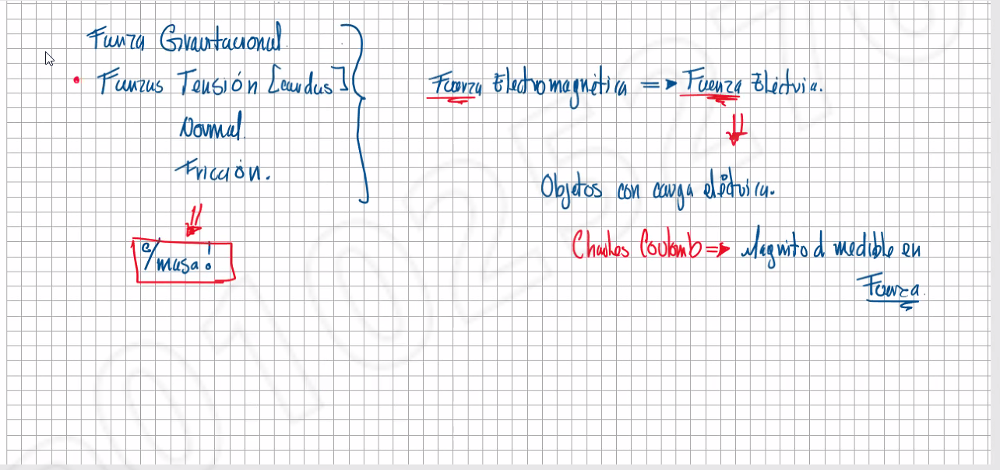

# Tipos de fuerzas

Para que haya una fuerza magnetica tiene que haber algo que se mueva, *masa*

En reumen, todas las fuerzas que se muestran tienen propiedades distintas, pero todas se pueden medir de varias formas, ya sea movimiento, vectores, o otras formas, entonces en cuestion de la electricidad, se usan varios metodos de medicion, pero en base, lo que se mide, es el movimiento del ***electron***

### Moviendo elecrones

Al tener contacto de 2 fuerzas, los electrones se mueven, haciendo que un lado quede cargado positivo (o perdida de electrones), o se cargue negativo ("gane" electrones)

Esto es algo que acurre de forma natural, por eso al tomar una esfera cargada, los pelos que tengas pueden pararse, tecnicamente estas haciendo que los electrones salgan de tu cuerop a travez de ellos.

## Conucion de benjamin frankling

Cargas opuestas se atraen, cargas similares se repelan:

Cargas|Relacion
-:|:-:
++|Se repelan
-+|Se atraen
+-|Se atraen
--|Se repelan

Esto se logro gracias a las [basculas de torcion de Coulomb](https://patentados.com/1994/bascula-de-torsion).

Benjamin comprobo esto frotando un tubo de vidrio con ceda, viendo que habia una nueva forma de atraccion.

### Fisica y quimica

Para entender como sirven los electrones, necesitamos antes entender como sirven los electrones. 

Cada elemento tiene algo que se llama electrones de valencia, que tecnicamente es la orbita que toma el ultimo grupo de electrones. Cada elemento maneja de forma distinta sus propiedades, pero en resumen, mientras mas electrones tenga mas fuera del nucleo, y cual sea su nivel electronico, es que tanto cede o atrae electrones.

##### _Nota: cuando tienen el maximo de sus electrones de valencia, no suelen perder ni guardar (los gases nobles no transfieren electrones normalmente)_

Al poner una barra de hule, con una de metal, el hule solo saca los electrones que tenga en la superficie, gracias a que no es un material conductor, mientras que un material conductor permite el flujo de electrones libre, gracias a que ellos no estan unidos como tal al atomo.

## Conductores y no conductores

1. Materiales conductores:

los materiales conductores permiten el flujo libre de electrones, ya que ellos no estan pegados al atomo. Esto permite que un electron pueda pasar de un lado del material al otro de forma practicamente instananea.

2. Materiales no conductores:

Los materiales no conductores, a diferencia de los conductores, no permiten que pasen lso electrones bajo practicamente ninguna circunstancia.

3. Semiconductores

Estos materiales pueden cambiar entre conductor y aislante bajo distintas propiedades, o en otras palabras, pueden condicir, y si le cambias la vida dejan de conducir. 

4. Superconductor

En palabras chidas, el superconductor es un conductor en esteroides (osea es instantaneo la transferencia de electrones).

## La tierra

Al tener un material que se cargue de alguna forma, podemos usar la tierra (grd) para poder drenar electrones por ese medio, de cierta forma, estamos cargando el mundo.

