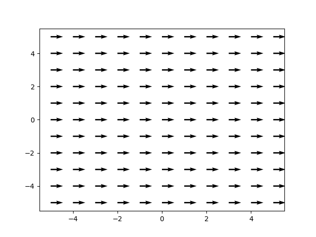
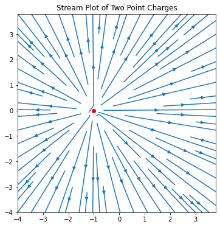
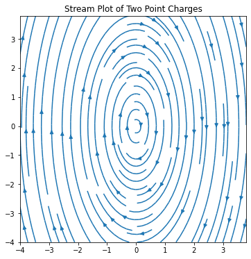
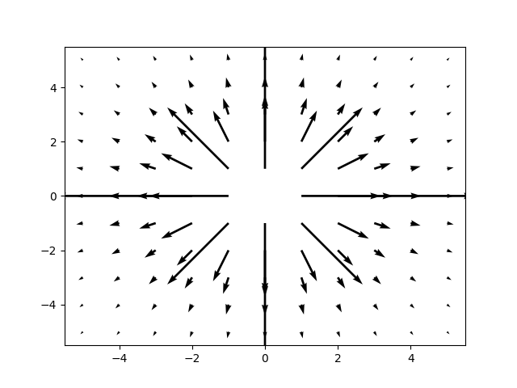
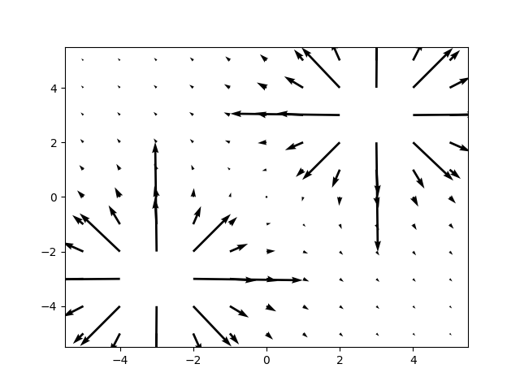
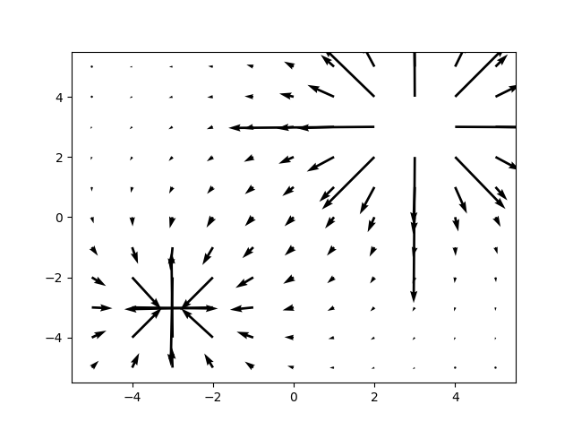

# Campos vectoriales 


Vamos a graficar algunos campos vectoriales, principalmente, el campo eléctrico. Recordemos que el campo eléctrico generado por una carga $q$ en el origen está dado por: $\vec{E} = {kq \over r^2} \hat{r}$ donde:

- $k$: es la constante de Coulomb, aproximadamente $9 \times 10^9 {N m^2 \over C^2}$.

- $q$: es la magnitud de la carga (puede ser positiva o negativa) y se mide en $C$.

- $r$: es la distancia que hay entre la carga (que en este caso está en el origen) y el punto sobre el que queremos evaluar el campo eléctrico.

- $\hat{r}$ : es un vector unitario que indica la dirección desde la carga hasta el punto en el que queremos evaluar el campo eléctrico.

- $\vec{E}$: es el campo eléctrico medido en $N \over C$ o en $V \over m$.

## Dibujando campos vectoriales

Al dibujar un campo vectorial, necesitamos 2 cosas, algo llamado un meshgrid, y vectores con el cual llenarlo.

EL codigo basico es como sigue:

```py
import numpy as np
import matplotlib.pyplot as plt

x, y = np.meshgrid(np.linspace(-5,5,11), np.linspace(-5,5,11))

u = 10
v = 0

plt.quiver(x,y,u,v)
plt.show()
```

donde:

> x > es el array del mapa en x
>
> y > es el array del mapa en y
>
> u > son los valores de la magnitud en un punto mirando hacia x (magnitud de los vectores en x)
>
> v > es la magnitud de los vectores hacia y  




## La otra forma

Otra forma de poder hacer lineas con vectores es usando `streamplot`

Streamplot permite hacer vectores de otra forma:

```py
import numpy as np
import matplotlib.pyplot as plt
# if using a Jupyter notebook, include:
# %matplotlib inline

x = np.arange(-4,4,0.2)
y = np.arange(-4,4,0.2)


X,Y = np.meshgrid(x,y)
Ex = (X + 1)/((X+1)**2 + Y**2)# - (X - 1)/((X-1)**2 + Y**2)
Ey = Y/((X+1)**2 + Y**2)# - Y/((X-1)**2 + Y**2)


fig, ax = plt.subplots(figsize=(6,6))


ax.streamplot(X,Y,Ex,Ey)


ax.set_aspect('equal')
ax.plot(-1,0,'-or')  # posición de la carga positiva (-1, 0)
#ax.plot(1,0,'-ob')   # posición de la carga negativa (1, 0)
ax.set_title('Stream Plot of Two Point Charges')


plt.show()
```



La ventaja de usar este metodo, es que puedes visualizar el cambio dentro del vector, o en otras palabras, las lineas se pueden doblar, lo cual es padre para muchas razones como hacer:



# Graficando campos electricos de electrones y protones

En base, las cargas tienen cierta fuerza, y las fuerzas conforme se alejan son mas debiles. 

Otra cosa, es que las cargas siempre se suman. Osea $\vec{F} = \vec{F_1} + \vec{F_2}$

### Calculando

En resumidas cuentas, podemos separar las formulas de la siguiente manera:

$$\vec{t_x} = kq\frac{x-Qx}{r^3}$$

$$\vec{t_y} = kq\frac{y-Qy}{r^3}$$

Para iniciar a sacar puntos, podemos tomar $k$ y $q$ como 0

```py
import numpy as np
import matplotlib.pyplot as plt

x, y = np.meshgrid(np.linspace(-5,5,11), np.linspace(-5,5,11))

Q_x = 0 # coordenada en pos 0
Q_y = 0 # coordenada en pos 0

E_x = (x - Q_x) / (np.sqrt((x - Q_x)**2 + (y - Q_y)**2))**3 
E_y = (y - Q_y) / (np.sqrt((x - Q_x)**2 + (y - Q_y)**2))**3

plt.quiver(x, y, E_x, E_y)
plt.show()
```

el cual muestra:




Podemos mejorar aun mas el nivel de calidad de todo si metemos k y q realistas:

```py
import numpy as np
import matplotlib.pyplot as plt

x, y = np.meshgrid(np.linspace(-5,5,11), np.linspace(-5,5,11))

Q_x = 0 # coordenada en pos 0
Q_y = 0 # coordenada en pos 0

k = 9 * 10 ** 9   # constante de Coulomb
q = 1 * 10 ** -9   # pico Coulombs

E_x = k*q*(x - Q_x) / (np.sqrt((x - Q_x)**2 + (y - Q_y)**2))**3 
E_y = k*q*(y - Q_y) / (np.sqrt((x - Q_x)**2 + (y - Q_y)**2))**3

plt.quiver(x, y, E_x, E_y)
plt.show()
```

Para poner 2 cargas distintas:



