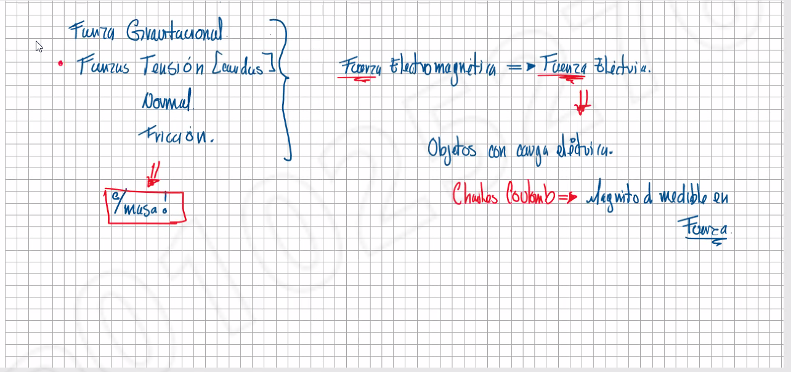

# Tipos de fuerzas

Para que haya una fuerza magnetica tiene que haber algo que se mueva, *masa*

En reumen, todas las fuerzas que se muestran tienen propiedades distintas, pero todas se pueden medir de varias formas, ya sea movimiento, vectores, o otras formas, entonces en cuestion de la electricidad, se usan varios metodos de medicion, pero en base, lo que se mide, es el movimiento del ***electron***

### Moviendo elecrones

Al tener contacto de 2 fuerzas, los electrones se mueven, haciendo que un lado quede cargado positivo (o perdida de electrones), o se cargue negativo ("gane" electrones)

Esto es algo que acurre de forma natural, por eso al tomar una esfera cargada, 
